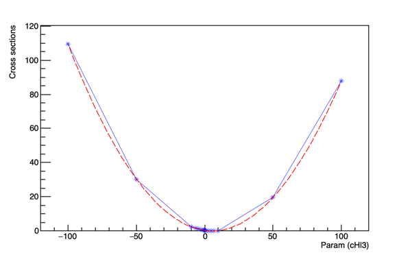

## Relevant operators:

|                    | `WWWW` | `WWZZ` | `ZZZZ`  | 
|--------------------|--------|--------|---------|
| cW                 | ✅     | ✅     | ❌      |
| cHW                | ✅     | ✅     | ✅      | 
| cHWB               | ✅     | ✅     | ✅      |
| cHDD               | ✅     | ✅     | ✅      |
| cB                 | ❌     | ❌     | ✅      |
| cHq1               | ✅     | ✅     | ✅      |
| cHq3               | ✅     | ✅     | ✅      |
| cHl3               | ✅     | ✅     | ✅      |
| cll1               | ✅     | ✅     | ✅      |
| cHu                | ❌     | ✅     | ✅      |
| cHd                | ❌     | ✅     | ✅      |

## Instructions for sample submission:

### Create the minimum bias file: 

dasgoclient -query="file dataset=/Neutrino_E-10_gun/RunIISummer20ULPrePremix-UL18_106X_upgrade2018_realistic_v11_L1v1-v2/PREMIX" > pileup_files.txt

### Running the production script

All code for the production can be found under the SubmittingJobs directory

1. sh triboson_production.sh -p pileup_files.txt -s WWW -c -o $PWD -a 1 -n 10 -b 12345 -l NoFilter -f

## Submission of jobs at the LPC cluster:

1. Use the script submitCondorJob.sh
2. To submit several jobs simply use submitCondorJob.sh in a loop as done here: submitJob.sh
3. Update the script triboson_production.sh with the correct url for procuring gridpacks and fragments

## Lepton filters:

#### We plan on submitting jobs in two modes:

1. Nofilter (NoFilter/wmLHEGS-fragment-2018.py)
2. Dilepton (Dilepton/wmLHEGS-fragment-2018.py)

## To generate samples with the use of specific filters, please use the version of scripts in this directory: ScriptWithLeptonFilterArg

For running an interactive test, please do:

sh triboson_production.sh -p pileup_files.txt -s WWW -c -o $PWD -a 1 -n 10 -b 12345 -l NoFilter

1. For DileptonFilter, -l argument is set to DileptonFilter

## Samples to generate

| Process            | `No filter` | `Two lepton filtered` |   `Events per lepton filter scenario` |
|--------------------|-------------|-----------------------|---------------------------------------|
| WWW                | ✅          | ✅                    |             1M		           |	
| WWZ                | ✅          | ✅                    |             1M	                   |
| WZZ                | ✅          | ✅                    |             1M		           |
| ZZZ                | ✅          | ✅                    |             1M	                   |

## Validation of weights

